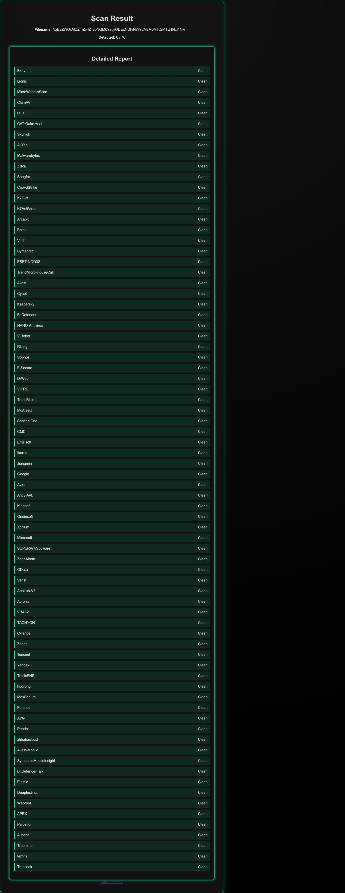
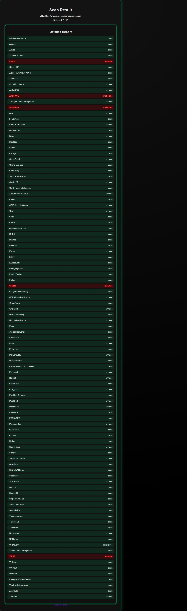

<h1 align="center">⚔️ SENTX - AI Powered Malware & URL Threat Scanner</h1>

<p align="center">
  
  
  
  
</p>

<p align="center">
  <b>Sentx</b> is a next-generation malware and URL scanner that integrates with the VirusTotal API to detect and visualize potential threats in real-time.<br>
  A perfect blend of <b>cyber defense aesthetics</b> and <b>intelligent threat analysis</b>.
</p>

---

## 🚀 Overview

**Sentx** is a modern, web-based malware scanner built using **Flask (Python)**.  
It allows users to upload suspicious files or URLs, scans them through **VirusTotal’s cloud engine**, and displays detection results in an elegant cyber-inspired UI.

Whether you’re a cybersecurity researcher, student, or enthusiast — **Sentx** makes threat intelligence simple, fast, and stylish. ⚡

---

## 🧩 Features

✨ **Dual Scan Mode**  
Scan both files and URLs with a single click.  

🧠 **VirusTotal Integration**  
Uses your VirusTotal API key to get accurate malware verdicts.  

🎨 **Cyber-Themed UI**  
Beautiful, dark cyberpunk-style design inspired by VirusTotal’s layout.  

📊 **Real-Time Results**  
Highlights detected vendors in **red**, and safe ones in **green**.  

🌐 **Cross-Platform**  
Runs smoothly on **Windows**, **macOS**, and **Linux**.  

---


## ⚙️ Installation

### 1️⃣ Clone the Repository
```bash
git clone https://github.com/<your-username>/Sentx.git
cd Sentx
```

### 2️⃣ Install Dependencies
```bash
pip install -r requirements.txt
```

### 3️⃣ Add Your VirusTotal API Key

Open config.py (or directly in your File_scanner.py / Url_scanner.py) and replace:
```bash
API_KEY = "e12e81636979414f0e10cf787195adcfca205062c460746db33dd0cffbce42ea"
```

### 4️⃣ Run the Application

```bash
python app.py
```

### 5️⃣ Access the Web App
Visit:
👉 http://127.0.0.1:5000


📁 Project Structure
Sentx/
│
├── app.py                    # Main Flask app
├── File_scanner.py           # File scanning logic (VirusTotal API)
├── Url_scanner.py            # URL scanning logic
├── static/                   # CSS, JS, and assets
│   └── style.css
├── templates/                # HTML templates
│   ├── index.html
│   ├── file_scan.html
│   ├── url_scan.html
│   └── result.html
├── screenshots/              # UI screenshots (for README)
│   ├── success_file_scan.png
│   └── success_url_scan.png
├── requirements.txt          # Dependencies
└── README.md


🧪 Screenshots
<p align="center">  <br><i>📂 File Scan - Detected Malware highlighted in red</i> </p> <p align="center">  <br><i>🌐 URL Scan - Verified clean or malicious links instantly</i> </p>


🔑 API Details
🔹 File Scan Endpoint
https://www.virustotal.com/api/v3/files

🔹 URL Scan Endpoint
https://www.virustotal.com/api/v3/urls

🔹 Header Format
headers = {
  "x-apikey": "e12e81636979414f0e10cf787195adcfca205062c460746db33dd0cffbce42ea"
}


💡 Future Enhancements

🧬 AI-powered threat prediction model

🛰️ Global malware map with live attack heat zones

📩 Email/SMS alerts for detected threats

📊 Admin dashboard with scan analytics

📜 License

This project is licensed under the MIT License.
You are free to use, modify, and distribute it for educational and research purposes.

👨‍💻 Author

Thilak Rajkumar
🎓 Cybersecurity Project (2025)
📧 Email Me
🌐 GitHub


🌟 Support
If you found Sentx useful or cool, please consider giving it a ⭐ on GitHub —
It helps others discover this project and keeps me motivated to build more cyber tools!

<p align="center">  </p>  ```
